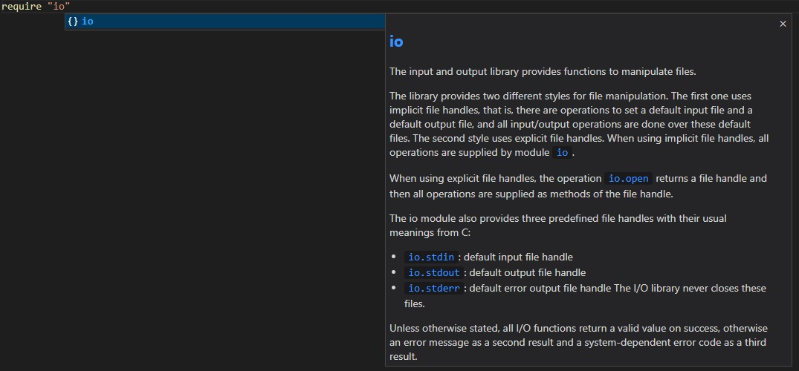

# Nelua vscode fork

Nelua better syntax highlighting, basic code completion, and snippets for Visual Studio Code.

## Features

### Completion
Code completion for `keywords`, `builtin functions`, `constants`, `types`, and `modules`.

### Snippets

1. **Function** declaration with `public` or `global`.
2. **Types** declaration for `record`, `enum`, or `union` with `public` or `global` scope.
3.  **If**, `if else`, `if elseif else` declaration.
4.  **Switch** with default case.
5.  **New scope** with `do`.
6.  **Goto** with `goto` keyword and declaration
7.  **While** declaration.
8.  **Repeat** with local variable declaration.
9.  **Anonymous** function declaration.

### Screenshots

## Installing

Install the extension [nelua](https://marketplace.visualstudio.com/items?itemName=alexgb.nelua) or clone this repository into ~/.vscode/extensions/ and restart vscode.

## Todo

- [X] More snippets.
- [X] Add competition to require.
- [ ] Add module completation.
- [ ] Add documentation to code completion and signatures to the functions.
- [X] Add run tasks.
- [ ] Add run task for windows
- [ ] Implement semantic highlighting.